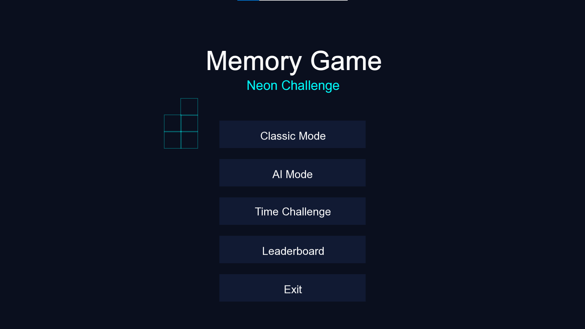
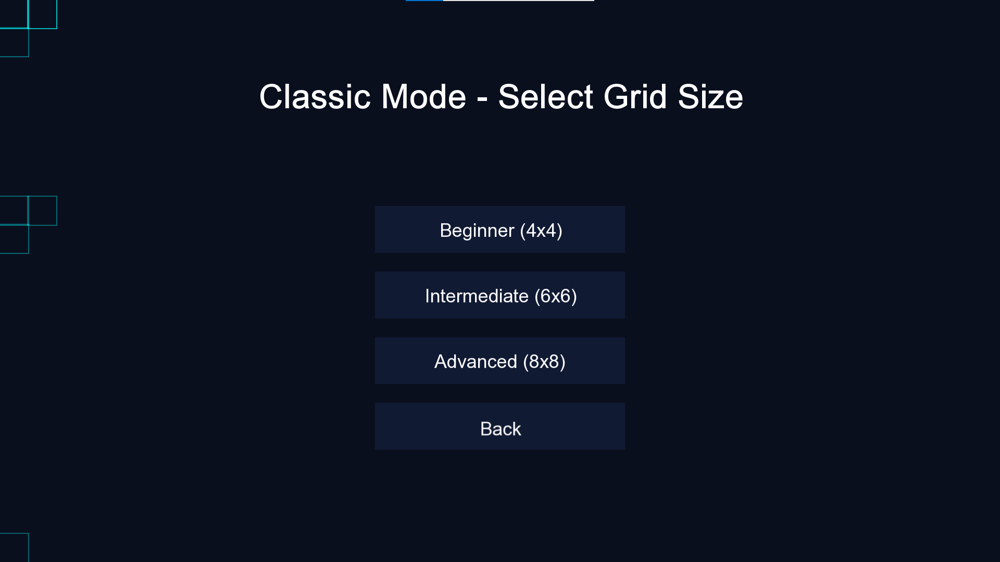
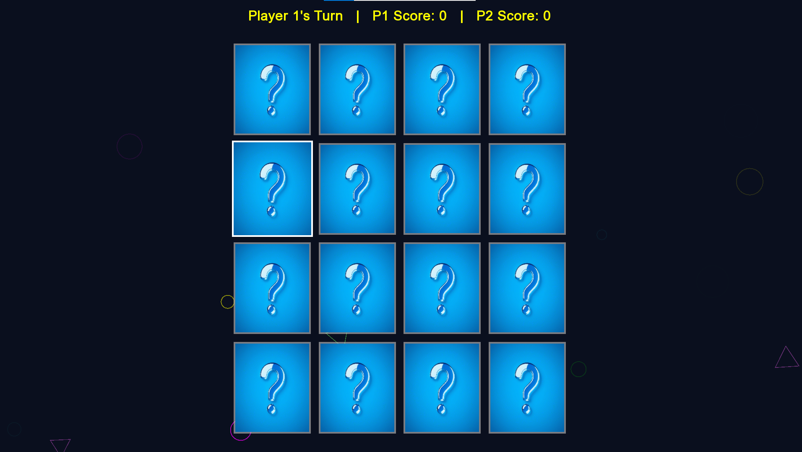

# Memory Match Pro - SFML Card Game


## Table of Contents
- [Project Overview](#-project-overview)
- [Media GAllery](#️-media-gallery)
- [Key Features](#-key-features)
- [Game Controls](#-game-controls)
- [Contributors](#-contributors)
- [License](#-license)

---

## 🏆 Project Overview
A high-performance memory card matching game featuring:
- **Three distinct game modes** with progressive difficulty
- **Neon-themed visual effects** with smooth animations
- **Persistent score tracking** via file serialization
---
## 🖼️ Media Gallery

### Game Screenshots
<div align="center">
  
   
  
</div>
---

## ✨ Key Features

### Game Modes
| Mode | Players | Description |
|------|---------|-------------|
| Classic | 2 | Turn-based competitive play |
| AI Challenge | 1 | Adaptive AI with memory system |
| Time Attack | 1 | Race against the clock |

### Technical Highlights
- **60 FPS rendering** with SFML hardware acceleration
- **Custom memory allocator** for card objects
- **State machine architecture** for game flow control
- **Modular design** for easy feature expansion

---

## 🎮 Game Controls

### Main Controls
| Action | Key/Mouse |
|--------|-----------|
| Select Card | Left Click |
| Pause Game | P |
| Return to Menu | ESC |
| Confirm Selection | Enter |
| Toggle Fullscreen | F11 |
---


### Architecture Overview
```mermaid
graph TD
    A[Source.cpp] --> B[GameManager]
    B --> C[GameBoard]
    B --> D[Player/AI System]
    C --> E[Card]
    D --> F[Player]
    D --> G[AI]
    B --> H[SFML Rendering]
    B --> I[Audio System]
    B --> J[FileHandler]